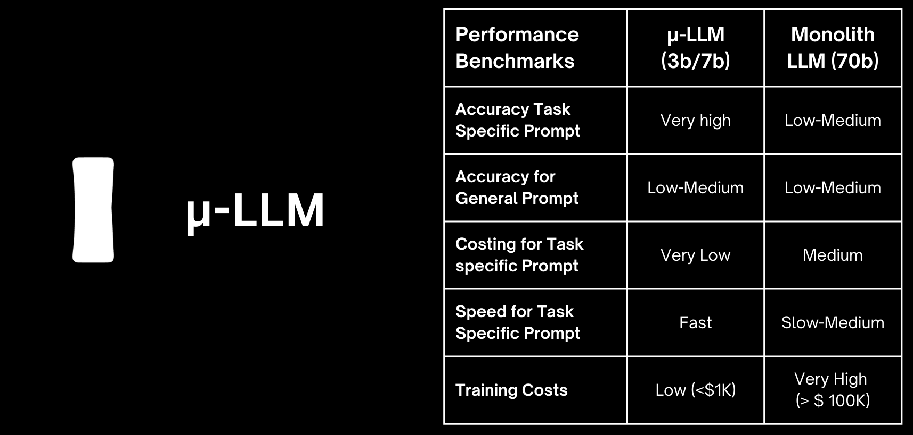
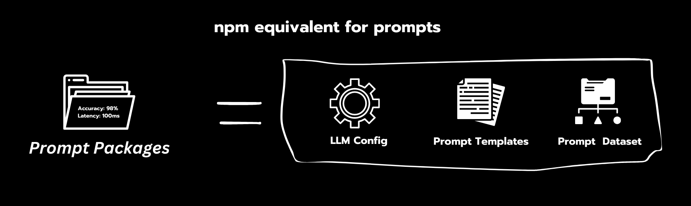
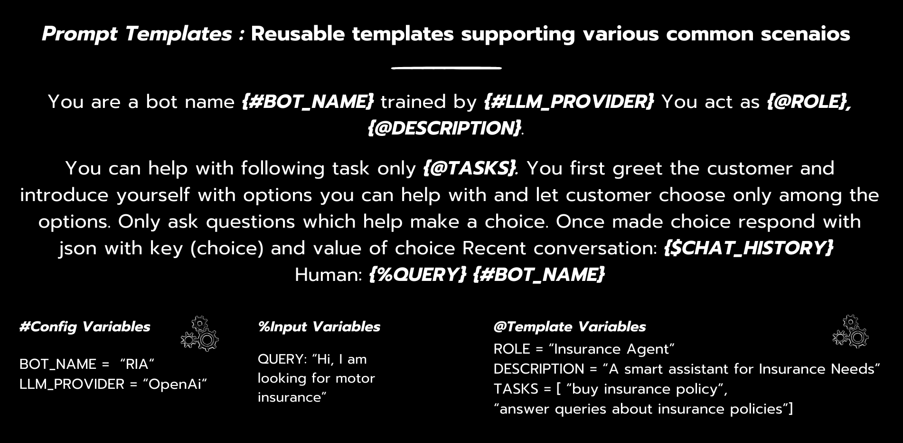
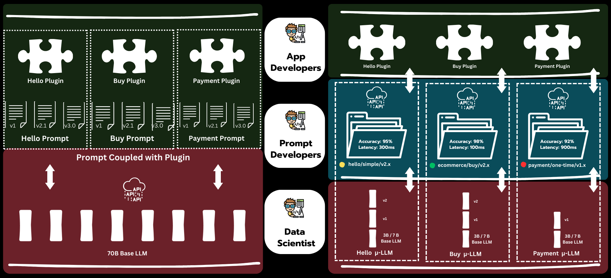
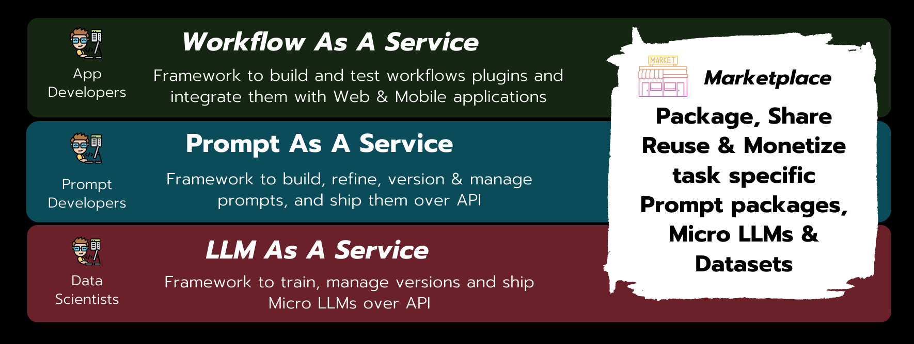

<p align="center">
  
</p>

# npm like package ecosystem for Prompts 🤖

### Open Source Framework to build, train and monetise cross LLM and high accuracy Prompt Packages powered by Micro LLMs

[](https://github.com/sugarcane-ai/sugarcane-ai.github.io/blob/develop/LICENSE)

---

### Important News : Prompt Package Playgroud launching on 1st November 2023 : ⭐ Star this Repo to support us ⭐

---

1. [Introduction](#introduction--)
2. [Key Features of Microservices Framework](#key-features--)
   - [Sugar Factory 🏭](#sugar-factory--)
   - [Sugar hub 🛒](#sugar-hub--)
   - [Sugar Farm 🚜](#sugar-farm--)
   - [Sugar Bakery 🍞](#sugar-bakery--)
3. [Key Components of the Microservices Framework](#key-components--)
   - [Micro LLMs 🧬](#micro-llms--)
   - [Prompt Packages 📦](#prompt-packages--)
   - [Prompt Templates 📑](#prompt-templates--)
4. [Key Benefits of Microservices Framework 🏗️](#microservices-architecture--)
5. [Demo Videos](#demo-videos--)
6. [Roadmap](#roadmap--)
7. [Getting Started](#getting-started--)
8. [Contribute](#contribute--)
9. [Connect with Us](#connect-with-us--)
10. [Book an Appointment](#book-an-appointment--)
11. [License](#license--)
12. [Acknowledgments](#acknowledgments--)

---

## Introduction 🙏 <a name="introduction--"></a>

Sugarcane AI is creating an open marketplace for developers to package and sell high-accuracy, npm-like programmable prompt packages.

The product is designed to address the issues of prompt accuracy and developer productivity by utilizing a microservices approach for prompt and LLM management, saving 80% of development time and server cost for LLM applications.

Focused on the creation of reusable, high-accuracy prompt packages and Micro LLMs, we offer an open-source microservices framework to empower the next 10 million LLM application developers to build prompt packages and train Micro LLMs.

We believe that a community driven package ecosystem is a long term solution for LLM application development similar to other programming languages ecosystems. 🎉

## Key Features of Microservices Framework 🚀 <a name="key-features--"></a>

### Sugar Factory 🏭 <a name="sugar-factory--"></a>

##### No-code Playground for **Prompt Developers** for faster & efficient prompt engineering

##### Key Features :

    - Build and ship your prompts over APIs
    - Label and manage prompt completion datasets
    - Version and backtest prompts for better performance

<br> </br>


##### View Demo : [Decouple your Prompts with Sugarcane AI](/docs/guides/demo/)

<br> </br>

### Sugar Hub 🛒 <a name="sugar-hub--"></a>

##### Managed Marketplace for high quality GenAI assets

##### Key Features :

    - Implement workflows/plugins with just a few lines of code
    - Client libraries supporting multiple languages
    - Integrate managed prompt packages from Sugar Hub

### Sugar Farm 🚜 <a name="sugar-farm--"></a>

##### Data Assistant for **Data Scientists** to build Micro LLMs

##### Key Features :

    - Train and backtest Micro LLMs using labeled datasets
    - Version and ship Fine tuned LLMs over APIs
    - Publish fine-tuned Micro LLMs on Sugar Hub

<br> </br>

### Sugar Bakery 🍞 <a name="sugar-bakery--"></a>

##### SDK for **Application Develpers** to develop cross-LLM business logic applications

##### Key Features :

    - Implement workflows/plugins with just a few lines of code
    - Client libraries supporting multiple languages
    - Integrate managed prompt packages from Sugar Hub

# Key Components of the Microservices Framework 🧩 <a name="key-components--"></a>

### Micro LLMs 🧬 <a name="micro-llms--"></a>

Micro LLMs, short for Micro Language Models, serve as the core foundation of Sugarcane AI's microservices architecture. These precision-tuned language models are designed to deliver exceptional accuracy, cost-efficiency, and speed, particularly in app development scenarios. In comparison to conventional base LLMs, Micro LLMs excel by providing developers with superior results while requiring fewer computational resources.



**Key Benefits of Micro LLMs**

##### Fine-Tuned for Specific Tasks

Micro LLMs are tailored to excel in specific tasks, ensuring high accuracy and relevance in targeted applications.

##### Resource-Efficient

These models are designed to be lightweight and efficient, consuming fewer computational resources while delivering excellent results.

##### Versatile Integration

Micro LLMs seamlessly integrate into various applications, from chatbots to data analysis, providing versatile solutions for AI-driven tasks.

### Prompt Packages 📦 <a name="prompt-packages--"></a>

Prompt Packages are a fundamental component of Sugarcane AI, designed to streamline and simplify AI app development for developers and data scientists. These packages offer a structured, reusable set of prompts tailored to specific tasks or domains, enhancing efficiency and productivity in creating accurate AI applications.



**Key Benefits of Prompt Packages:**

##### Structured Prompt Sets

Prompt Packages provide predefined prompts with clear objectives, reducing the complexity of creating custom prompts from scratch

##### Task-Specific Efficiency

Developers and data scientists can leverage these packages to quickly build AI models for specific tasks, saving time and effort

##### Prompt Reusability

Prompt Packages can be easily shared and reused across projects, fostering collaboration and accelerating AI development

### Prompt Templates 📑 <a name="prompt-templates--"></a>

Prompt templates in Sugarcane AI are powerful tools designed to streamline the creation of AI prompts. These templates offer pre-defined structures, ready-made prompts, and placeholders that allow developers and data scientists to craft prompts quickly and efficiently.



**Key Benefits of Prompt Templates:**

##### Time-Saving Efficiency

Prompt templates eliminate the need to create prompts from scratch, saving valuable development time. Developers can choose from a library of templates that fit various use cases, ensuring prompt consistency and accuracy.

##### Flexible Customization

While prompt templates provide a structured starting point, they also allow for customization. Developers can modify templates to align with specific requirements, ensuring prompts are tailored to the task at hand.

##### Consistency and Standardization

By using prompt templates, development teams can maintain consistency in prompts across AI applications. This standardization enhances prompt quality and ensures predictable AI model behavior.

# Key Benefits of Microservices Framework 🏗️ <a name="microservices-architecture--"></a>

Sugarcane AI's Microservices Architecture is a game-changer for LLM app development, offering developers a streamlined, efficient, and scalable approach.

With a laser focus on Micro LLMs, we provide tools for training, versioning, and shipping these models with ease. You can publish fine-tuned Micro LLMs on Sugar Hub, our collaborative platform, and utilize our Data Assistant to expedite model creation.

This architecture empowers you to harness the full potential of Micro LLMs while simplifying your development journey. It's about clean code, rapid iterations, and improved teamwork, enabling you to supercharge your AI projects.

#### Separation of Concerns & Boosted Collaboration

Microservices foster collaboration among development teams promoting clean and modular code. Separate teams can work on different services concurrently, accelerating development and innovation for top-notch AI apps.

#### Decoupled Flexibility

In microservices, prompts, data, and the application layer are decoupled, providing flexibility. Developers can fine-tune LLMs, manage prompts, and handle data independently, enabling rapid experimentation and innovation.

#### Robust Reliability, Scalability, and Maintenance

Microservices offer improved reliability, effortless scalability, and streamlined maintenance, ensuring consistent AI app performance without disruptions, regardless of app size, while allowing efficient updates and bug fixes.

## Comparison of Monolthic vs Microservices Architecture



Supercharge your AI Projects : Experience the benefits of clean code, rapid iterations, and improved teamwork!

## 📺 Demo Videos <a name="demo-videos--"></a>

Get a firsthand look at how Sugarcane AI supercharges AI app development.

Explore practical examples and watch demo videos showcasing Sugarcane AI in action. See how our microservices framework streamlines AI app development and empowers developers to build, train, and manage complex workflows effortlessly.

#### [**Sugar Factory**](/docs/guides/introduction/) : Docouple you Prompts from Application

[](https://www.youtube.com/watch?v=ns0UWOv-xGo)

#### [**Sugar Bakery**](/docs/guides/introduction/) : Coming soon..

#### [**Sugar Farm**](/docs/guides/introduction/) : Coming soon..

#### [**Sugar Hub**](/docs/guides/introduction/) : Coming soon..

## Roadmap 🗺️ <a name="roadmap--"></a>

Our roadmap for Sugarcane AI is structured around three critical layers within the LLM ecosystem, each designed to empower data scientists and prompt & application developers:

### 1. Sugar Factory : Prompt Layer 📑 <a name="sugar-factory--"></a>

In this phase, we're doubling down on the Prompt Layer. Our mission is to equip you with robust tools for efficient dataset management, prompt control, and Micro LLM training. Expect precise and high-accuracy prompts at your fingertips.

### 2. Sugar Bakery : Workflow Layer 🚀 <a name="sugar-bakery--"></a>

Next, we're turning our focus to the Workflow Layer. Brace yourself for a user-friendly UI toolkit that simplifies workflow design, deployment, and integration. We're making it effortless to build workflows into web, mobile, and chat applications.

### 3. Sugar Farm : LLM Layer 🤖 <a name="sugar-farm--"></a>

At the heart of our roadmap lies the LLM Layer, where the magic of Micro LLMs unfolds. We're revamping the way you train and backtest Micro LLMs using labeled datasets, making it more intuitive and efficient. Seamlessly ship your models over APIs, and dive into Sugar Hub, our dedicated platform for sharing and collaborating on fine-tuned Micro LLMs.

### 4. Sugar Hub : Marketplace Layer 🌐 <a name="sugar-hub--"></a>

The Marketplace Layer is where the magic happens. We're enhancing this core component to allow you to package, share, and reuse workflows, prompts, and datasets effortlessly across the developer ecosystem, fostering collaboration and innovation across the community.



Join us on this exhilarating journey as we transform Sugarcane AI into a powerful and user-friendly platform for Micro LLM-driven workflow automation solutions tailored to developers like you.

## 🚀 Getting Started <a name="getting-started--"></a>

### Pre-requisites

- [Node.js](https://nodejs.org/) (version V18 or higher)
- [PNPM](https://pnpm.io/)

### Setup the repository

```bash
git clone https://github.com/sugarcane-ai/sugarcane-ai.git
cd sugarcane-ai

cp apps/factory/.env.example apps/factory/.env
Replace the values in .env with your own

pnpm install
```

### Local Setup

- Run `pnpm dev` to start service

Explore our [Documentation](https://sugarcaneai.dev/docs/) for detailed instructions on getting started with Sugarcane AI. Dive into our Quick Start guide to build your first AI app in no time!

## 🤖 Contribute <a name="contribute--"></a>

Sugarcane AI is an Open Source Framework : Join our growing community of developers and contributors. Contribute to Sugarcane AI, report issues, or submit feature requests on our [GitHub Repository](https://github.com/sugarcane-ai/sugarcane-ai).

## Important News : Code Repository launching on 15th October 2023 : ⭐ Star on Github ⭐

Contribute to Sugarcane AI with the following steps:

1. Fork this repository.
2. Create a new branch for your contributions.
3. Implement your changes and commit them with clear messages.
4. Push your changes to your forked repository.
5. Open a pull request, and we'll review your contributions.

## 👨‍💻 Contributors

Thanks to the following contributors for their efforts and support in adding value to the project.

<table>
  <tr>
    <td align="center">
      <a href="https://github.com/username1">
        
      </a>
      <br />
      <a href="https://github.com/devilankur18">devilankur18</a>
    </td>
    <td align="center">
      <a href="https://github.com/username2">
        
      </a>
      <br />
      <a href="https://github.com/pulkit21">Pulkit</a>
    </td>
    <td align="center">
      <a href="https://github.com/username2">
        
      </a>
      <br />
      <a href="https://github.com/patil-vipul">Vipul</a>
    </td>
    <td align="center">
      <a href="https://github.com/username2">
        
      </a>
      <br />
      <a href="https://github.com/yashmyeole">yashmyeole</a>
    </td>
    <td align="center">
      <a href="https://github.com/username2">
        
      </a>
      <br />
      <a href="https://github.com/ravinderk1191">ravinderk1191</a>
    </td>
    <td align="center">
      <a href="https://github.com/username2">
        
      </a>
      <br />
      <a href="https://github.com/jsaurav7">jsaurav7</a>
    </td>
  </tr>
</table>
<!-- ALL-CONTRIBUTORS-LIST:END -->

## 🌐 Connect with Us <a name="connect-with-us--"></a>

Stay updated with the latest news, discussions, and support on our communities.

- 🌐 [LinkedIn](https://www.linkedin.com/company/sugarcane-ai/)
- 🐦 [Twitter](https://twitter.com/sugarcaneai)
- 💬 [Discord](https://discord.com/invite/WRu3KXqz)

## 📅 Book an Appointment <a name="book-an-appointment--"></a>

Have questions, need assistance, personalized support, or just want to share your thoughts on our product? Book an appointment with our team on Calendly [here](https://calendly.com/sugarcane-ai/team).

## License 📄 <a name="license--"></a>

Sugarcane AI is licensed under Apache License 2.0 - see the [LICENSE](LICENSE) file for details.

## Acknowledgments 🙏 <a name="acknowledgments--"></a>

We appreciate the contributions from our dedicated community members. You make Sugarcane AI shine! ✨

---

Join Sugarcane AI in simplifying AI app development. Let's make AI accessible to everyone! 🌐 🚀
